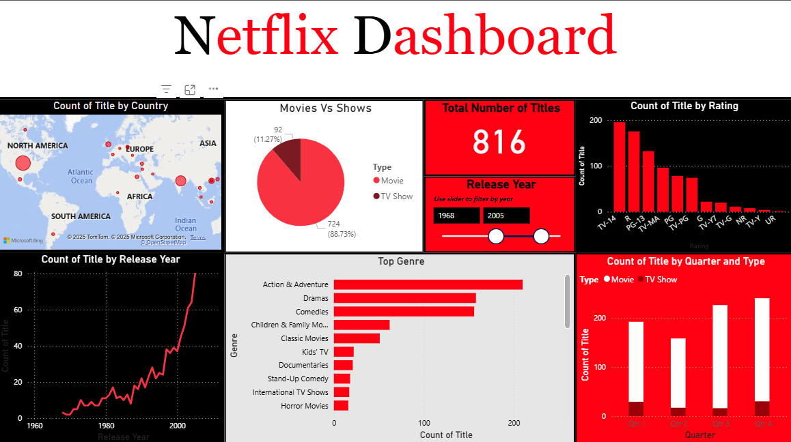

# 📺 Netflix Data Analysis Dashboard (Power BI)

A visually rich and insightful dashboard built using Power BI to explore and analyze Netflix's content library. This project focuses on identifying trends in content type, genres, countries, and release patterns over time.

---

## 🔧 Tools Used
- **Power BI**: Data modeling, DAX, and dashboard design
- **Excel / Power Query**: Data cleaning and transformation

---

## 📌 Dataset
Source: Netflix content data (public dataset shared for analysis) https://www.kaggle.com/datasets/shivamb/netflix-shows?resource=download

Key fields:
- Title, Type (Movie/TV Show), Country, Genre, Rating, Duration, Date Added, Release Year

---

## 📊 Dashboard Features

### 1. **Total Titles Overview**
- Total number of titles in the dataset
- Release Year slicer to filter insights dynamically

### 2. **Content Type Distribution**
- Pie chart showing Movies vs TV Shows

### 3. **Top Genres**
- Horizontal bar chart visualizing most frequent genres

### 4. **Content by Rating**
- Bar chart showing how titles are rated (TV-MA, PG-13, etc.)

### 5. **Titles by Country**
- World map visualizing title distribution globally

### 6. **Yearly Release Trends**
- Line chart showing content growth over time

### 7. **Quarterly Trends**
- Clustered bar chart to observe content release patterns across quarters

---

## 📷 Dashboard Preview

---

## 🗂 Files in this Repo
- `netflix_dashboard.pbix` → Power BI dashboard file
- `netflix_cleaned.csv` → Cleaned dataset (optional)
- `screenshot.png` → Image preview of the dashboard
- `README.md` → Project documentation

---

## 🔍 How to View the Dashboard
1. Download the `.pbix` file
2. Open it using [Power BI Desktop](https://powerbi.microsoft.com/desktop/)
3. Explore the visualizations and slicers

---

## 🧠 Key Takeaways
- Netflix’s content skewed heavily toward movies (85%+)
- Content production surged post-2010
- US, India, and UK lead in content volume
- Most common ratings are **TV-MA**, **TV-14**, and **R**
- Genres like **Drama**, **Comedy**, and **Family** dominate the catalog

---

## 🧩 Future Improvements
- Add interactive tooltips with top titles per genre
- Enable filters for duration and directors
- Deploy to Power BI Service for public sharing

---

## 🤝 Let's Connect
Feel free to connect with me on [LinkedIn](https://linkedin.com) or explore more of my projects!

